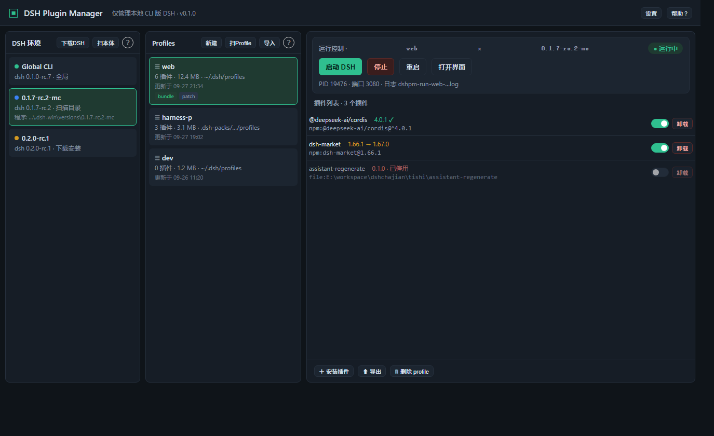
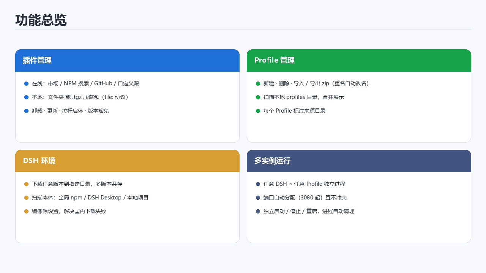
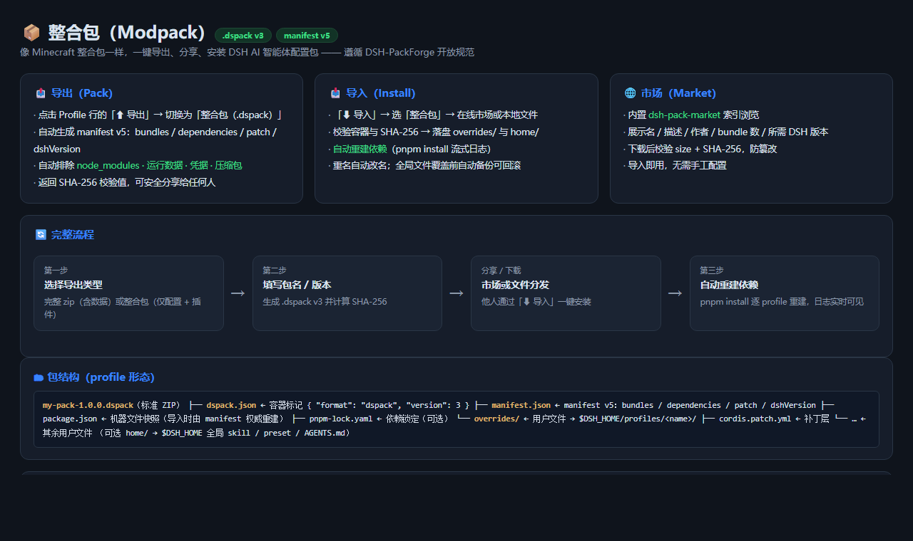
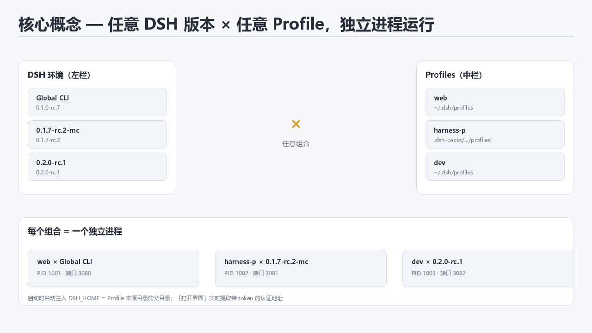

# DSH Manager

> 车同轨，书同文。DSH 的多版本、插件、Profile 与整合包，从此归于一统。
>
> 无需本地拥有任何环境,也无需手动安装DSH,开箱即用


面向 **DSH** 的桌面管理工具（Tauri 2 + React 19 + TypeScript）。在图形界面中完成 DSH 多版本下载管理、Profile 管理(整合包管理)、插件安装与管理、**整合包（.dspack）导出 / 导入 / 市场**、多实例独立启动，无需手敲命令行。


## 解决什么问题
1. 安装或者升级一个插件导致DSH启动错误或者异常？——> 本软件支持直接通过图形化插件管理关闭或者降级插件让DSH正常启动
2. 升级DSH后所有插件失效?——>本软件支持同时共存多个DSH版本，在保留你所有插件功能的同时可以复制已有的profile来为你适配新版DSH提供容错
3. 不想一个一个插件自己安装尝试？——>本软件支持整合包功能，内置整合包市场，一键导入市场中的整合包
4. 自己手动安装管理插件麻烦?——>本软件支持插件管理，内置插件市场，支持管理每个profile中的插件
5. 不想开命令行，还想同时跑好几个 DSH / Profile？——> 图形化启动 / 停止 / 重启，任意 DSH 版本 × 任意 Profile 多实例并行，端口自动分配互不冲突

***

## 界面布局




| 区域 | 内容                                                   |
| -- | ---------------------------------------------------- |
| 左栏 | DSH 环境（每个 = 一个 DSH 程序本体，可多版本共存）                      |
| 中栏 | Profiles（合并默认 `~/.dsh/profiles` + 扫描目录，不绑定任何 DSH 版本，可以管理整合包） |
| 右栏 | 当前 Profile 的插件列表与操作、运行控制（启动 / 停止 / 重启 / 打开界面）        |

## 功能特性




### 插件管理


* **在线安装**：内置插件市场（参考 `dsh-market/dsh-market`）、NPM 搜索安装、GitHub 安装、自定义源安装

* **本地安装**：选择**文件夹**（含 `package.json`）或 **.tgz 压缩包**，按 `file:` 协议复制安装到指定 Profile

* **插件列表**：卸载 / 更新（检查 npm 新版本）/ 启用停用（拉杆开关，写 `cordis.patch.yml`）

* **版本豁免**：插件与当前 dsh runtime 的 `peerDependencies` 不兼容时，可显式授权豁免安装

### Profile 管理（整合包管理）


* 新建 / 删除 Profile

* **导入 / 导出**为 zip 压缩包（可排除 `node_modules`；重名自动改名）

* **整合包（.dspack）导入导出**：遵循 [DSH-PackForge](https://github.com/DSH-PackForge/DSH-PackForge) 规范（manifest v5 / 容器 v3）——
  导出自动排除 `node_modules` / 运行数据 / 凭据，导入自动重建依赖（pnpm install 流式日志），重名自动改名

* **整合包市场**：在线浏览 [dsh-pack-market](https://github.com/DSH-PackForge/dsh-pack-market) 索引，下载并校验 `SHA-256` + `size` 后导入

* **右键备注**：给 Profile 添加备注与「适配版本」提示（下拉选择左栏 DSH 版本，仅作提示、无任何约束）

* **扫描目录**：把本地任意 profiles 目录（如 DSH Desktop 的 `.dsh-packs`）加入列表

### DSH 环境管理


* **下载多版本 DSH** 到指定目录，电脑可同时拥有多个版本

* **扫描本体**：从已安装目录（全局 npm / DSH Desktop 内置 / 本地项目）自动探测 `dsh.cmd` / `bin.js` 并读取版本

* **镜像源设置**：自定义 npm registry（默认 `registry.npmmirror.com`），解决大陆网络下载失败

### 多实例运行


* 任意 **DSH 版本 × 任意 Profile** 可自由组合，各自**独立进程**

* **端口自动分配**（从 3080 起避开已占用），互不冲突

* 每个实例独立 **启动 / 停止 / 重启**；进程退出自动清理、重启按钮自动还原

* 「打开界面」实时从运行日志提取**带 token 的认证地址**，一步到位进入 DSH Web UI

### 体验细节


* 环境与 Profile 列表**拖拽排序**（重启保留）

* **记住上次选择**的 DSH 环境与 Profile

* 左栏 / 中栏标题右侧 `?` 按钮提供板块使用说明

* 全程无命令行黑框（所有后台命令均以无窗口方式执行）


***

## 整合包（Modpack）—— 重点功能



像 Minecraft 整合包一样，把 DSH AI 智能体配置**一键导出、分享、安装**。遵循开源规范 [DSH-PackForge](https://github.com/DSH-PackForge/DSH-PackForge)（`.dspack` **容器 v3** + **manifest v5**），可与生态内其他启动器互通。

### 总体功能

| 能力 | 说明 |
| --- | --- |
| **导出** | 把当前 Profile 打成 `.dspack`：插件组合、依赖、补丁、适配 DSH 版本；自动排除 `node_modules` / 运行数据 / 凭据 |
| **导入** | 本地 `.dspack` 或在线市场下载；校验容器与 SHA-256 后落盘，**自动重建依赖** |
| **市场** | 浏览 [dsh-pack-market](https://github.com/DSH-PackForge/dsh-pack-market) 索引，按需下载安装 |
| **备注** | 导入时自动写入「适配 DSH 版本」到 Profile 右键备注，便于识别 |

一个 `.dspack` = 一个 Profile 的**配置快照**（或整个 `DSH_HOME`）：

* **profile 形态**：单个 Profile（可额外携带全局 skill / preset）
* **dshhome 形态**：多 Profile + 全局 preset / skill / 指令

**不含** `node_modules`、运行数据、凭据、嵌套压缩包 —— 体积小、可安全分享。

---

### 1. 导出整合包（Pack）


1. 中栏 Profile 行点击 **⬆ 导出**，在弹窗中切换到 **「整合包（.dspack）」**
2. 填写：
   * **包名**：小写 slug（如 `my-pack`）
   * **版本**：默认 `1.0.0`
   * **显示名**：可选
   * **适配版本**：下拉选择 DSH 版本（也可自定义；写入 `manifest.dshVersion`）
3. 选择保存位置 → 生成 `.dspack`，并显示 **SHA-256** 校验值

导出时自动执行安全过滤（精确名 / 密钥扩展名 / 凭据文件名 / 嵌套压缩包 / home 级运行时目录），不会把敏感内容打进包里。

---

### 2. 导入整合包（Install）

1. 中栏点击 **⬇ 导入** → 选择 **「整合包（.dspack）」**
2. 来源二选一：
   * **本地导入整合包**：选择本机 `.dspack` 文件
   * **在线下载整合包**：从市场选择（见下一节）
3. 导入全自动：
   * 校验容器（`dspack.json` 的 format/version）→ 解析 manifest v5
   * 落盘 `overrides/` → Profile 根；`home/` → `DSH_HOME`
   * **自动重建依赖**（pnpm install，日志实时滚动）
   * 重名自动改名（`xxx-import-1`…）；覆盖全局文件前备份到 `~/.dshpm-import-bak-<ts>/`，失败整体回滚
   * 若包内声明了依赖的 DSH 版本，会写入该 Profile 的**备注「适配版本」**

---

### 3. 在线市场（Market）

1. **⬇ 导入** → **整合包** → **在线下载整合包**
2. 列表展示：显示名 / 描述 / 作者 / bundle 数 / 依赖数 / **所需 DSH 版本** / 更新时间
3. 选择后下载：逐字节校验 **size + SHA-256**，不完整或篡改直接拒绝、不落盘
4. 校验通过后走与本地导入相同的落盘 + 重建依赖流程

---

### 4. Profile 备注（配合整合包）

* **右键**任意 Profile → 添加备注 / **适配版本**（下拉可选左栏 DSH 版本）
* 适配版本**仅作提示**，不影响实际运行
* 同名不同来源目录的 Profile 可各自备注

---
## 核心概念




* **DSH 环境**：一个 DSH 可执行文件（版本 / 安装位置）。`下载DSH`、`扫本体` 或全局 CLI 自动识别产生。

* **Profile**：一套独立的插件集合与配置（`package.json` + `cordis.patch.yml`），类似 DSH 的 "配置档"。

* **组合启动**：选中任意环境 + 任意 Profile → 启动。应用自动注入 `DSH_HOME` 指向该 Profile 的来源目录，实现任意版本加载任意来源的 Profile。


***

## 快速开始（Windows）

两个产物任选其一（均在 `src-tauri/target/release/` 下）：


1. **便携版单文件 exe**：`dsh-plugin-manager.exe`，绿色免安装，**单文件无 dll**，复制即用

2. **NSIS 安装器**：`bundle/nsis/dsh-plugin-manager_0.1.0_x64-setup.exe`，双击安装

> 依赖系统 
>
> **WebView2 运行时**
>
> （Win10/11 一般自带）。配置数据保存在 
>
> `%AppData%\dsh-plugin-manager`
>
> 。

首次使用建议顺序：下载 / 扫描 DSH → 初始化或扫描 Profile → 选中组合 → 启动 → 打开界面。


***

## 开发指南

### 环境要求


* Windows 10/11

* [Rust](https://www.rust-lang.org/)（stable）

* [Node.js](https://nodejs.org/) ≥ 18 与 [pnpm](https://pnpm.io/)

### 本地开发


```
\# 安装依赖

pnpm install

\# 启动前端开发服务（Vite，端口 1420）

pnpm dev

\# 另开终端，启动桌面应用（开发模式）

pnpm tauri dev
```

### 构建 / 打包


```
\# 前端构建

pnpm build

\# 打包（app 裸 exe + NSIS 安装器）

pnpm tauri build
```

### 测试


```
\# 前端单元测试（Vitest + Testing Library）

pnpm test

\# 后端单元测试（Rust）

cd src-tauri && cargo test --lib
```

当前基线：前端 51 项测试、后端 107+ 项测试（持续更新）。

### 项目结构


```
dshcjaz/

├── src/                    # 前端（React + TS + Vite）

│   ├── App.tsx             # 主界面（三栏布局、运行控制）

│   ├── InstallDialog.tsx   # 插件安装对话框（在线/本地）

│   ├── api.ts              # Tauri invoke 封装

│   ├── reorder.ts          # 拖拽排序工具

│   └── \*.test.tsx          # 前端测试

├── src-tauri/              # 后端（Rust + Tauri 2）

│   └── src/

│       ├── lib.rs          # 命令注册与业务编排

│       ├── runner.rs       # 进程调度：启动/停止/端口探测/token 提取

│       ├── scanner.rs      # 环境扫描、Profile 探测

│       ├── installer.rs    # 插件安装/卸载/豁免

│       ├── market.rs       # 插件市场数据

│       ├── npm.rs          # npm 搜索与更新检查

│       ├── profile\_io.rs   # Profile 导入导出

│       ├── packforge.rs    # 整合包：.dspack v3 导出/导入/市场/校验/备注

│       ├── dsh\_install.rs  # 多版本 DSH 下载安装

│       └── settings.rs     # 镜像源等设置持久化

└── 需求文档.md              # 需求与迭代记录
```


***

## 数据与配置


| 数据                    | 位置                                                     |
| --------------------- | ------------------------------------------------------ |
| 应用设置（镜像源、DSH 下载目录）    | `%AppData%\dsh-plugin-manager\settings.json`           |
| 排序与上次选择（localStorage） | 随应用数据目录                                                |
| Profile（默认）           | `~/.dsh/profiles`                                      |
| Profile 备注              | `%AppData%\dsh-plugin-manager\profile-notes.json`      |
| 整合包下载缓存             | `%AppData%\dsh-plugin-manager\packs\`                 |
| 运行日志                  | 系统临时目录 `dshpm-run-<profile>-<ts>.log`（供「打开界面」提取 token） |


***

## 常见问题（FAQ）
**Q：为什么「打开界面」要用带 token 的地址？**

dsh web 只监听 `127.0.0.1`，且访问需认证 token（`dsh web: http://127.0.0.1:<port>/?token=...`）。应用在启动后保留日志，「打开界面」时实时提取最新 token，避免出现 `authentication required`。

**Q：如何让多个实例同时运行？**

任意环境 × Profile 组合各自独立进程，端口从 3080 起自动分配（可手动指定），每个实例独立停止 / 重启。

**Q：为什么装了插件还是加载不了？**

插件与 dsh runtime 的 `peerDependencies` 不兼容时会被拒绝；可在插件管理中对特定版本授权豁免（`allow-version`）。

**Q：启动后进程立即退出？**

通常是 DSH 版本与 Profile 不匹配（如旧版 dsh 加载新版 Profile 导致 `ERR_MODULE_NOT_FOUND`）。请选择匹配的 DSH 版本，或查看运行日志诊断。

**Q：整合包和完整 zip 有什么区别？**

完整 zip 是整目录快照（含运行数据 / node_modules），适合本机备份恢复；整合包（.dspack）只含配置 + 插件 + 补丁，遵循 DSH-PackForge 规范，体积小、可分享，导入时自动重建依赖，还能从在线市场直接安装。

**Q：导入整合包后插件没生效？**

导入已自动执行依赖重建（pnpm install）。若日志显示失败（如网络原因），可在插件管理中对该 Profile 点「修复依赖」重试；版本豁免类问题见上方 FAQ。

**Q：整合包文件能被篡改吗？**

在线市场条目携带 `SHA-256` + `size`，下载后逐字节校验，不匹配直接拒绝；本地导入也会校验容器结构，非法文件报错并回滚。

**Q：国内网络下载失败怎么办？**

在「设置」中切换 npm 镜像源（默认已为 `registry.npmmirror.com`），DSH 下载与插件安装均使用该源。


***

## 技术栈


* **桌面框架**：Tauri 2（Rust 后端 + 系统 WebView2）

* **前端**：React 19、TypeScript、Vite 8

* **测试**：Vitest + Testing Library（前端）、cargo test（后端）

* **包管理**：pnpm

## 致谢
感谢[Linux.do](https://linux.do/)社区的支持与帮助。
本项目站在这些优秀开源项目的肩膀上（列主要的）：

**核心框架**

* [Tauri](https://tauri.app)：跨平台桌面应用框架（Rust 后端 + 系统 WebView2）

* [React](https://react.dev)：前端 UI 库

**生态项目**

* [DSH-PackForge](https://github.com/DSH-PackForge/DSH-PackForge)：`.dspack` 整合包开放规范

* [dsh-pack-market](https://github.com/DSH-PackForge/dsh-pack-market)：整合包市场索引

* dsh-market 生态：插件市场的实现思路参考

* DeepSeek Harness（DSH）：本工具所管理的平台本身

以上项目版权归原作者所有，感谢各位维护者的付出。

## 开源协议

本项目采用 **CC BY-NC-SA 4.0**（署名-非商业性使用-相同方式共享）协议发布，版权声明归 `dshpm` 所有：

* ✅ 允许个人 / 学习 / 研究等**非商业**用途的使用、修改与分发
* ❌ **禁止商业用途**（商用请先联系作者获得书面授权）
* 🔁 修改或再分发时必须**以相同协议开源**（附完整源码）并保留署名

协议全文见 [LICENSE](./LICENSE)。注意：含非商业条款的协议不符合 OSI「开源」定义，严格称法为「源码可见（source-available）」；本 README 中「开源」均指源码公开、自由取用。
